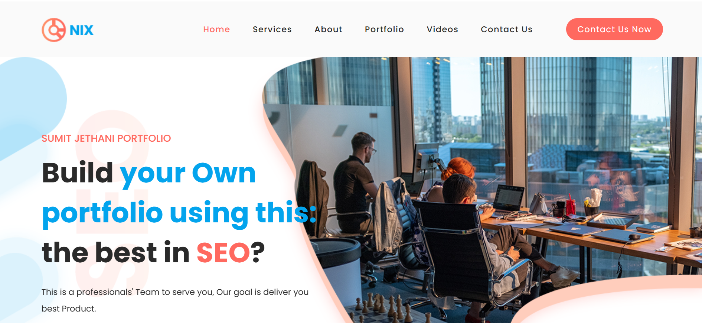

# 🌟 Sumit Jethani's Portfolio Website

Welcome to my personal portfolio website! This project showcases my skills, projects, and professional journey as a developer. Built with modern web technologies, this sleek and responsive site is designed to provide a glimpse into my work and expertise. 🚀



## 📋 Table of Contents
- [About the Project](#about-the-project)
- [Features](#features)
- [Tech Stack](#tech-stack)
- [Getting Started](#getting-started)
  - [Prerequisites](#prerequisites)
  - [Installation](#installation)
  - [Running the Project](#running-the-project)
- [Customizing the Portfolio](#customizing-the-portfolio)
  - [Editing Content](#editing-content)
  - [Styling](#styling)
  - [Adding New Sections](#adding-new-sections)
- [Deploying the Website](#deploying-the-website)
- [Contributing](#contributing)
- [Contact](#contact)

## ℹ️ About the Project
This portfolio website is a static, single-page application designed to highlight my professional background, technical skills, and notable projects. It serves as an online resume and a platform to connect with potential collaborators or employers. The site is fully responsive, ensuring a seamless experience across devices.

## ✨ Features
- **Responsive Design**: Adapts beautifully to desktops, tablets, and mobile devices.
- **Interactive UI**: Smooth animations and transitions for an engaging user experience.
- **Project Showcase**: Dedicated section to display my work with links to live demos and repositories.
- **Contact Form**: Easy way for visitors to reach out (if implemented).
- **SEO Optimized**: Structured for better search engine visibility.
- **Easy Customization**: Modular code structure for quick updates.

## 🛠️ Tech Stack
- **HTML5**: For semantic structure.
- **CSS3**: For styling, possibly with frameworks like Bootstrap or Tailwind CSS.
- **JavaScript**: For interactivity, possibly with libraries like jQuery or frameworks like React.
- **GitHub Pages**: For hosting the static site.
- **Optional**: SASS/SCSS for advanced CSS preprocessing, or a static site generator like Jekyll.

*Note: Update this section with specific tools if the repository uses a unique stack.*

## 🚀 Getting Started

Follow these steps to set up and run the portfolio website locally.

### 📌 Prerequisites
Ensure you have:
- **Git**: [Download Git](https://git-scm.com/downloads)
- **Node.js**: (If dependencies are used) [Download Node.js](https://nodejs.org/) (v14+ recommended)
- **Code Editor**: [VS Code](https://code.visualstudio.com/) or similar
- **Web Browser**: Chrome, Firefox, etc.
- **Live Server**: (Optional) [Live Server VS Code Extension](https://marketplace.visualstudio.com/items?itemName=ritwickdey.LiveServer)

### 📥 Installation
1. **Clone the Repository**:
   ```bash
   git clone https://github.com/sumitjethani/Portfolio-Website.git
   cd Portfolio-Website
   ```
2. **Install Dependencies (if applicable): If a package.json exists, run:**:
   ```bash
   npm install
   ```
3. **Verify Folder Structure: Ensure these exist:**
- index.html: Main entry point
- assets/: Contains images/, css/styles.css, js/script.js
- (Optional) node_modules/ for dependencies

### ▶️ Running the Project
1. **Option 1: Open Directly:**
- Open index.html in a browser.
- Note: Some features may require a server.
2. **Option 2: Use Live Server:**
- In VS Code, right-click index.html > "Open with Live Server".
- Access at http://localhost:5500.
3. **Option 3: Run with Node.js (if applicable): If a dev server exists, run:**
   ```bash
   npm start
   ```
   Access at http://localhost:3000 (check package.json for port).
   
### 🎨 Customizing the Portfolio
Make this portfolio your own by updating content, styles, or adding sections.

### ✍️ Editing Content
- Update Text:
  - Edit index.html or relevant HTML files.
  - Example: Update the About section:
```bash
<p>Hi, I'm Sumit Jethani, a passionate web developer...</p>
```
- Update Images:
  - Replace files in assets/images/ with your own.
  - Ensure filenames match HTML/CSS references.
- Update Projects:
   - Add new projects in the Projects section:
   ```bash
   <div class="project">
  <h3>My Awesome Project</h3>
  <p>Description of the project.</p>
  <a href="https://github.com/your-repo">View Code</a>
  </div>
   ```
   
### 🎨 Styling
- Edit CSS:
  - Modify assets/css/styles.css for colors, fonts, etc.
  - Example: Change primary color:
```bash
:root {
  --primary-color: #007bff;
}
```

- Use CSS Frameworks (if applicable):
  - Update HTML classes for Bootstrap/Tailwind styles.
- Add Animations:
  - Use CSS or libraries like Animate.css:
```bash
<div class="animate__animated animate__fadeIn">Content</div>
```

### ➕ Adding New Sections
- Create a Section:
  - Add a <section> in index.html:
  ```bash
  <section id="blog">
  <h2>Blog</h2>
  <p>Check out my latest posts!</p>
  </section>
  ```
  
- Update Navigation:
  - Add a navbar link:
  ```bash
  <a href="#blog">Blog</a>
  ```
- Style the Section:
  - Add to styles.css:
  ```bash
  #blog {
  padding: 50px;
  background-color: #f9f9f9;
  }
  ```

### 🌐 Deploying the Website
Host your portfolio using GitHub Pages.

1. Create a Repository:
- Name it <your-username>.github.io (e.g., sumitjethani.github.io).
- Push code to main:
```bash
git add .
git commit -m "Initial portfolio commit"
git push origin main
```

2. Enable GitHub Pages:
- Go to Settings > Pages.
- Select main branch under "Source" and save.
- Site will be live at https://<your-username>.github.io.

3. Update Content:
- Commit and push changes to update the live site:
```bash
git add .
git commit -m "Updated portfolio"
git push origin main
```
Tip: For advanced hosting, try Netlify or Vercel.

### 🤝 Contributing
1. Fork the repository.
2. Create a branch: git checkout -b feature/your-feature.
3. Commit changes: git commit -m "Add feature".
4. Push: git push origin feature/your-feature.
5. Open a Pull Request.
6. Ensure code follows project standards with clear comments.

### 📬 Contact
Name: Sumit Jethani
Email: sumitjethani123@gmail.com
GitHub: sumitjethani
LinkedIn: Your LinkedIn Profile
Portfolio: Live Site
Feel free to reach out with questions or collaboration ideas!